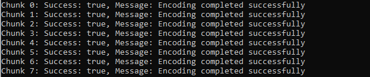

## This is a file storage application that uses erasure coding

### Architecture

#### Nodes
- Naming node
- Data node
- Parity node
- Encoder node(Client)
- Decoder node(Client)

### Steps to run the application
#### Start the Encoder Decoder Node and Mount the decoded folder to your file path
docker build -t ubuntu-c .
docker run -d --name handler -p 50051:50051 -p 50052:50052 -v C:\Users\<username>\Downloads\:/app/decoder-rpc/server/decoded ubuntu-c 

- Execute the below commands to build the encoder, prepare the protofiles and starting the server.
- go inside the helper container and run "go run main.go server.go" inside decoder-rpc/server and test-rpc/server
- This is to avoid creating another container. 
- But ideally you can create one for decoder and encoder from the same image just provide specific port-mappings for each one.
- Move the schema.sql to the nameserver and build the database "test"
- docker cp schema.sql mysql-container:/

- Now Head into the storage-instance directory and start the containers. Does not matter what name you give to them make sure to note the IPs.
- build image: docker build -t server-image .
- docker run --name <server-node-1> -p 9443:9443 server-image (make sure to start K+M servers)
- Until we start using docker-compose for a containerized env (Coming soon) we wiil have to manually make note of the ips used by all the servers we just started and update the server_config for handler/app/test-rpc/server and handler/app/decoder-rpc/server. 

### Lets See it in action. 😉
We are going to run the servers in containers. But it can be extended to VMs or standalone Servers.

The default setup has M=2 and K=3 i.e 3 data storage nodes and 2 parity storage nodes. Which means we can afford upto M = 2 failures and still generate the data.

This is where we are at after starting all the severs. Lets do a "docker ps"

As you can see we are running 3 data nodes and 2 parity nodes.

Now we will be uploading the file via cli. So move the file you want to send to test-rpc/client directory and run "go run main.go <file_name>"

output of "go run main.go video.mp4"

We have implemented chunked file transfer using gRPC, which allows efficient streaming and processing of large files.

🔄 Why Chunks?
gRPC has a default message size limit of 4 MB.
We chose to send data in 3 MB chunks to stay under the limit and ensure stable transmission.

📤 Transfer Flow
Files are read and divided into 3 MB chunks.
Each chunk is sent to the gRPC service using a FileRequest.
The server receives and encodes each chunk.

Encoded data is distributed to data and parity nodes for redundancy and recovery

Now to test the High Availability feature of the setup. We will be bringing down 2 nodes at random (data0 and parity0).

#### 🛡️ High Availability Test
To validate the system’s fault tolerance, we simulate node failures and verify that file reconstruction remains possible using the remaining nodes.

🔧 Test Scenario
We intentionally shut down two storage nodes at random:

data0
parity0

This simulates partial system failure while maintaining the ability to reconstruct missing data from redundancy/parity.

As seen below, the stopped nodes are no longer running:

Now lets download the file.
to do this go to  decoder-rpc/client from root dirctory of the project and run "go run <file_name>"

output of "go run main.go video.mp4"

final file 🤩:

As you can see we have successfully downloaded the full file, even if two of our storage servers went down. The increase in filesize is due to the default 64KB blocks that we use to write the decoded data.

### Implemented
- Handle uploads via chunking to microservices for encoding
- Naming server that stores metadata
- Download client that pulls data and decodes

### Features in development
- High Availability during Upload
- Conccurent uploads
- Conccurent Downloads
- Upload/Download retries
- Builder Node